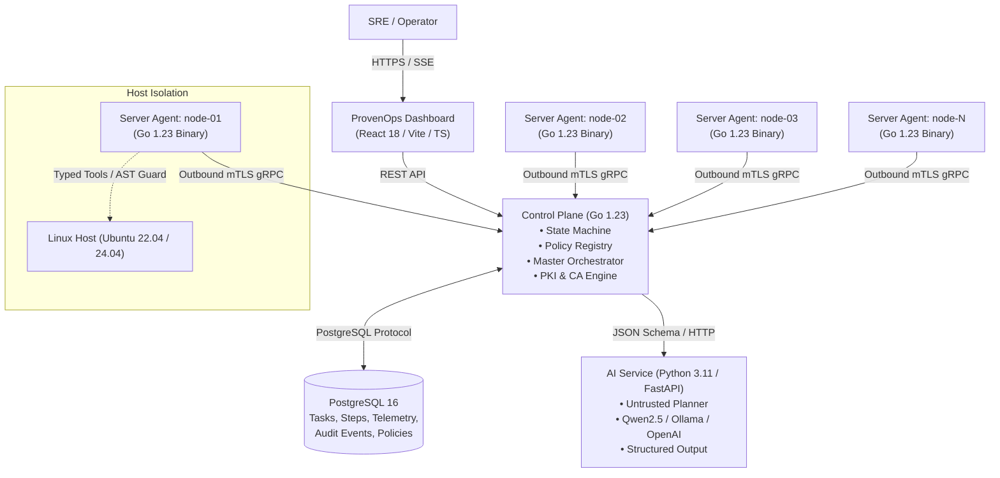

# ProvenOps

> **Policy-controlled infrastructure operations with deterministic verification.**  
> A platform where AI plans operations, deterministic policy authorizes them, restricted agents execute them, and independent verification proves the resulting state.

[](https://go.dev/)
[](https://python.org/)
[](https://www.postgresql.org/)
[](LICENSE)
[](#production-validation)

---

## Why ProvenOps?

Modern DevOps and SRE teams are increasingly pressured to automate infrastructure operations. While Large Language Models (LLMs) excel at natural-language comprehension and complex reasoning, giving an LLM direct shell or SSH access creates unacceptable enterprise risks:

- **Hallucinated Success:** An LLM may claim an operation succeeded when the underlying service crashed or the port failed to bind.
- **Uncontrolled Blast Radius:** A hallucinated argument or loop can wipe partitions, terminate production clusters, or trigger cascading outages.
- **Indirect Prompt Injection:** Adversarial logs, command outputs, or scraped content can hijack LLM execution flow to run malicious commands.
- **Missing Auditability:** Direct shell sessions lack structured, immutable audit trails and deterministic state reconciliation.

**ProvenOps eliminates the "LLM + SSH" failure mode entirely.** It treats AI models as untrusted probabilistic planners. Authority resides exclusively in the Go Control Plane policy engine, execution is constrained to typed agent primitives, and success requires independent empirical verification.

---

## Core Principle

```
      AI Plans
         ↓
  Schema Validates
         ↓
  Policy Authorizes
         ↓
Human Approval (When Required)
         ↓
Restricted Agent Executes
         ↓
Independent Verification
         ↓
 Evidence is Persisted
```

### EXECUTED != VERIFIED

A command returning `exit code 0` does not mean the system reached the desired state:
- A configuration file can be written with syntax errors.
- A daemon can fork, exit `0`, and immediately crash in an initialization loop.
- A port might remain bound by another process.

In ProvenOps, an operation is never marked successful until independent probes (TCP socket connectivity, HTTP status codes, systemd active state, file checksum verification) confirm reality matches intent.

---

## Architecture

ProvenOps is organized into decoupled layers with strict security boundaries:



### Component Responsibilities

| Component | Stack | Responsibilities |
| :--- | :--- | :--- |
| **Control Plane** | Go 1.23, Chi, pgx/v5, gRPC | Single source of authority: state machine, policy matrix, orchestrator, PKI CA, audit trail, SSE event hub. |
| **Server Agent** | Go 1.23 (single binary) | Restricted host runner: outbound mTLS gRPC, typed primitives, AST command guard, bbolt execution ledger. |
| **AI Service** | Python 3.11, FastAPI, Pydantic | Untrusted planner: generates structured step plans, bounded context, heuristic fallback. |
| **Dashboard** | React 18, Vite, TS, Tailwind | Technical UI: fleet status, real-time SSE execution logs, approval gates, audit explorer. |
| **Database** | PostgreSQL 16 | ACID-compliant storage for tasks, steps, agents, tokens, audit events, and verification evidence. |

---

## Core Capabilities

- **Typed Execution Primitives:** High-risk shell calls are replaced by deterministic tools (`apt_install`, `write_config_file`, `systemd_action`, `read_file`).
- **Policy Engine & Risk Matrix:** Actions are mapped to static risk tiers (`READ_ONLY`, `LOW`, `MEDIUM`, `HIGH`, `FORBIDDEN`). Self-reported risk claims from the model are discarded.
- **Human Approval Gates:** High-risk actions automatically transition tasks to `WAITING_APPROVAL` and require explicit operator authorization.
- **Mutual TLS with Dynamic Revocation:** Outbound-only agent connections secured by mTLS (ECDSA P-256). Certificate revocation list (CRL) serial checking is enforced at TLS handshake.
- **Desired-State Idempotency:** Tools check active host state before mutation; redundant executions are skipped.
- **Deterministic Verification Engine:** Independent probes (`tcp_port_open`, `http_status`, `systemd_active`, `checksum_match`) record empirical evidence in PostgreSQL.
- **Saga Orchestrator & LIFO Rollback:** Downstream step failures trigger automatic reverse compensation, restoring pre-flight configuration backups.
- **DAG Execution Engine:** Operations are compiled into directed acyclic graphs with dependency resolution and parallel branch execution.
- **Fleet Canary & Rolling Rollouts:** Multi-node operations execute through configurable canary stages and sequential batches, halting immediately on failure to limit blast radius.
- **Crash Recovery & Execution Ledger:** Control Plane restarts recover in-flight tasks without duplication. Agents persist an embedded bbolt ledger across process restarts.
- **Remediation Budget:** Self-healing loops are bounded by strict attempt counters, transitioning to `MANUAL_INTERVENTION_REQUIRED` upon exhaustion.
- **Immutable Audit Trail:** Append-only database ledger records every state transition, user approval, command output, and verification check with automatic secret redaction.

---

## Security Model

```
       Untrusted AI Model
               ↓
┌──────────────────────────────┐
│  Untrusted Prompt / Input    │
└──────────────┬───────────────┘
               │
               ▼
┌──────────────────────────────┐
│   Control Plane Authority    │  ◄── Policy Matrix & Static RBAC
└──────────────┬───────────────┘
               │
               ▼
┌──────────────────────────────┐
│    Restricted Agent Host     │  ◄── Non-Root Runner, AST Guard
└──────────────┬───────────────┘
               │
               ▼
┌──────────────────────────────┐
│  Host Output / Observations  │  ◄── Wrapped in <UNTRUSTED_OBSERVATION>
└──────────────────────────────┘
```

1. **AI Service is Untrusted:** The model possesses no credentials, cannot initiate connections, and cannot execute commands.
2. **Server Observations are Untrusted:** All host outputs (`stdout`, `stderr`, logs) are quarantined inside `<UNTRUSTED_OBSERVATION>` tags to prevent indirect prompt injection.
3. **AST Command Guard:** Freeform commands passed to `execute_command` are parsed by an abstract syntax tree token analyzer. Destructive calls (`rm -rf /`, `mkfs`, `fdisk`, `dd`, `shutdown`, fork bombs) are blocked at the agent boundary.
4. **Secret Redaction:** Passwords, API tokens, JWT signatures, and private keys are scrubbed by an automated regex redactor before reaching the audit log, database, or SSE streams.
5. **Network Isolation:** Agent containers can only communicate with the Control Plane gRPC port (9090). PostgreSQL (5432) and the AI Service (8000) are inaccessible from host nodes.

---

## Failure Model

ProvenOps is engineered to withstand real-world distributed systems failures. Full failure taxonomy and recovery strategies are detailed in [docs/FAILURE_MODEL.md](docs/FAILURE_MODEL.md):

- **Network Partitions:** Agents reconnect with exponential backoff and resume streaming without duplicate dispatch.
- **Control Plane Crash Mid-Execution:** Recovery scanner transitions interrupted tasks to terminal states or triggers compensation.
- **Agent Process Kill:** Embedded bbolt ledger recovers in-progress mutations to `UNKNOWN` and blocks blind retries.
- **AI Service Outage:** System degrades gracefully to heuristic planning and operator-defined runbooks.

---

## Production Validation

ProvenOps enforces an anti-false-green validation rule: **PASS exit code != VERIFIED**. Every claim is tested against the live 5-node cluster, asserting disk state, database records, and network behavior.

Run the production validation suite:

```bash
make validate-production
```

### Verified Claims Matrix

| Area | Test Identifier | Empirical Verification Method | Status |
| :--- | :--- | :--- | :---: |
| **Verification Contract** | `verification_contract` | Go unit tests + live port failure assertion in PostgreSQL | **VERIFIED** |
| **Canary Rollout** | `canary_blast_radius_halting` | Canary failure halts rollout; nodes 02–05 verified untouched | **VERIFIED** |
| **Rolling Rollout** | `rolling_deployment_batch_enforcement` | Batch sequence and threshold enforcement tests | **VERIFIED** |
| **Saga Compensation** | `saga_lifo_rollback_compensation` | Real node file mutation, downstream fail, backup hash matched | **VERIFIED** |
| **DAG Orchestration** | `dag_dependency_resolution` | Diamond dependency ordering and parallel execution | **VERIFIED** |
| **Retry & Timeout** | `retry_and_timeout_engine` | Context cancellation kills long-running commands | **VERIFIED** |
| **Remediation Budget** | `remediation_budget_enforcement` | Exhausted budget transitions to `MANUAL_INTERVENTION_REQUIRED` | **VERIFIED** |
| **CP Restart Recovery** | `control_plane_restart_active_execution` | Container restart recovers task state; completed steps preserved | **VERIFIED** |
| **Agent Crash Ledger** | `agent_kill_ledger_reconciliation` | bbolt ledger reconciles state across process kill/restart | **VERIFIED** |
| **Network Partition** | `network_partition_resilience` | Network disconnect/reconnect maintains mTLS session | **VERIFIED** |
| **mTLS Revocation** | `revoked_certificate_handshake_rejection` | Revoked client cert rejected at TLS handshake (bad cert alert) | **VERIFIED** |
| **Command Guard** | `command_guard_pipeline_blocking` | AST guard blocks `rm -rf /`, `curl\|bash`, `/etc/shadow` unharmed | **VERIFIED** |
| **Secret Redaction** | `secret_redaction_in_logs_and_audit` | Injected credentials and JWTs verified absent in database | **VERIFIED** |
| **Race Detector** | `go_race_detector_concurrency` | 0 data races across state machine, PKI, Saga, and fleet | **VERIFIED** |
| **Network Isolation** | `docker_network_isolation` | Node agents blocked from DB and AI ports; only CP 9090 accessible | **VERIFIED** |

*For full test output and JSON schemas, see [artifacts/validation-report.md](artifacts/validation-report.md).*

---

## Quick Start

### Prerequisites
- Docker Engine 24.0+
- Docker Compose v2.20+

### 1. Clone & Configure
```bash
git clone https://github.com/Erenen1/Infra_Agent.git ProvenOps
cd ProvenOps
cp .env.example .env
```

### 2. Start Central Stack
```bash
docker compose up --build -d
```

Access the core services:
- **Dashboard:** [http://localhost:3000](http://localhost:3000)
- **Control Plane API & SSE:** [http://localhost:8080](http://localhost:8080)
- **Control Plane gRPC:** `localhost:9090`
- **AI Service:** [http://localhost:8000](http://localhost:8000)
- **PostgreSQL 16:** `localhost:5432`

---

## Multi-Node Lab

ProvenOps includes a 5-node Docker lab simulating realistic Ubuntu Linux target hosts (`node-01` through `node-05`):

```bash
# Launch central stack and 5 lab nodes
make lab-up

# Tear down lab and clean volumes
make lab-down
```

Each lab node automatically enrolls with the Control Plane over mTLS upon startup.

---

## Testing

```bash
# Run all unit tests (Go and Python)
make test

# Run Go tests with data race detection
make test-race

# Run empirical production validation against running lab
make validate-production

# Clean build artifacts
make clean
```

---

## Repository Structure

```
ProvenOps/
├── agent/                  # Server Agent (Go 1.23 single binary)
│   ├── cmd/agent/          # Binary entrypoint
│   └── internal/           # Client, executor, tools, ledger, guard
├── apps/
│   ├── control-plane/      # Central Authority (Go 1.23)
│   │   ├── cmd/server/     # Control Plane entrypoint
│   │   └── internal/       # FSM, PKI, fleet, saga, verification, security
│   ├── ai-service/         # Untrusted Planner (Python 3.11 / FastAPI)
│   │   ├── app/            # Prompts, schemas, planner, diagnostic grounding
│   │   └── tests/          # AI Service test suite
│   └── dashboard/          # Management UI (React 18 / TypeScript / Vite)
│       └── src/            # FleetView, Timeline, Approval gates
├── proto/                  # Protobuf definitions for gRPC contracts
├── db/migrations/          # PostgreSQL schemas and migration scripts
├── docs/                   # Architecture, threat model, failure model docs
├── scripts/                # Production validator and automation scripts
├── docker-compose.yml      # Containerized deployment manifest
└── Makefile                # Developer and CI command targets
```

---

## Configuration

Configuration is managed via environment variables. `PROVENOPS_*` prefixes take precedence; legacy `OPSPILOT_*` variables are supported for backward compatibility.

| Variable | Default | Purpose |
| :--- | :--- | :--- |
| `PROVENOPS_DATABASE_URL` | `postgres://...` | PostgreSQL connection string |
| `PROVENOPS_HTTP_PORT` | `8080` | Control Plane REST/SSE port |
| `PROVENOPS_GRPC_PORT` | `9090` | Control Plane mTLS gRPC port |
| `PROVENOPS_JWT_SECRET` | *(min 32 bytes)* | Session token signing secret |
| `PROVENOPS_BOOTSTRAP_TOKEN`| *(secret string)* | Node agent initial enrollment secret |
| `PROVENOPS_AI_SERVICE_URL` | `http://ai-service:8000` | AI Planner endpoint |
| `PROVENOPS_TLS_ENABLED` | `true` | Enforces mTLS across all gRPC traffic |

---

## Documentation

- [Threat Model & Security Guardrails](docs/THREAT_MODEL.md)
- [Failure Model & Distributed Recovery](docs/FAILURE_MODEL.md)
- [Production Readiness Audit](docs/PRODUCTION_READINESS.md)
- [Architecture & State Machine](docs/context/ARCHITECTURE.md)

---

## Known Limitations

- **Docker Lab vs Bare-Metal:** While the 5-node lab uses full Ubuntu 22.04 environments with systemd and network stacks, hardware virtualization quirks (e.g., kernel module loading, raw disk partitioning) are not tested in containers.
- **PostgreSQL High Availability:** The platform requires PostgreSQL 16. Database replication, clustering, and failover are the responsibility of the infrastructure operator.
- **External AI Provider Availability:** When using cloud LLM providers (e.g., OpenAI), network latency and provider rate limits can impact planning latency. ProvenOps includes heuristic fallback for critical paths.
- **Root CA Lifecycle:** The current internal CA rotates leaf certificates automatically. Root CA rotation requires planned manual intervention.

---

## Project Status

**Production-Ready for Defined Scope**  
Validated for single-region, multi-node Linux fleet operations under policy control with deterministic verification.

---

## License

ProvenOps is open-source software licensed under the [MIT License](LICENSE).
